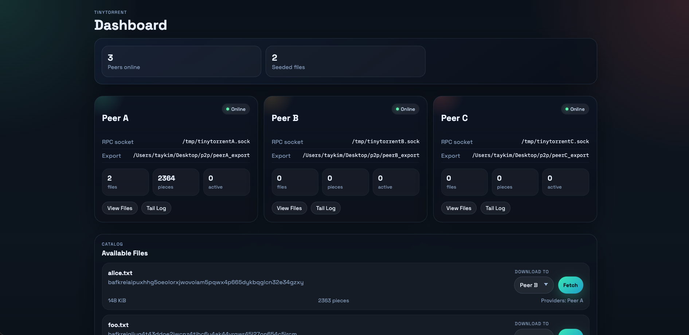

# TinyTorrent

A P2P file sharing system that implements the core ideas of BitTorrent.

## Overview

* **Chunked Transfers**: Files are chunked into smaller pieces and downloaded concurrently.
* **Peer Discovery**: Kademlia DHT integration allows peers to discover the swarm providing a requested file.
* **Download Scheduling**: Rarest-first piece selection improves file availability.
* **Provider Selection**: Among available providers, choose one with the best observed download rate.
* **Choking-Based Incentives**: Peers limit uploads through choking and drives fair resource allocation.
* **File Integrity**: Hashing detects corrupted file pieces.

## Demo

See `demo/` for a guided demo of the system in action.



## Usage

Build the binary:

```bash
go build -o tinytorrent .
```

To run the test suite:

```bash
go test ./...
```

---

The `tinytorrent` binary supports two ways of running a node:

- **Interactive shell**: Start a node in the foreground and type commands directly into a REPL.
- **Control over RPC**: Start a node in the background and control it by issuing requests over a local UNIX RPC socket.

### Mode 1: Interactive Shell

Start a seed node in the foreground:

```bash
./tinytorrent shell --listen /ip4/127.0.0.1/tcp/4001 --export_dir ./my_files --name peerA
```

Create or update a file from inside the shell and inspect the local catalog:

```text
peerA> echo "hello from peer A" > foo.txt
peerA> files
```

To join an existing network, start another shell with `--bootstrap` pointing at a known `/ip4/.../p2p/<PeerID>` multiaddr:

```bash
./tinytorrent shell --listen /ip4/127.0.0.1/tcp/4002 --export_dir ./my_files --name peerB --bootstrap <P2P_MULTIADDR_FROM_SEED>
```

**Interactive Commands**

- `help`: Show available shell commands.
- `id`: Show this node's peer ID and listen addresses.
- `files`: Show local files discovered in `export_dir`.
- `cat <filename>`: Print a file from `export_dir`.
- `whohas <manifest-cid>`: Query the DHT for peers participating in a manifest swarm.
- `fetch <manifest-cid>`: Download a file by manifest CID from the swarm.
- `list <multiaddr|alias>`: Ask a specific peer for the files it is serving.
- `alias <name> <target>`: Save a short alias for a peer ID or full multiaddr.
- `aliases`: Show configured aliases.
- `unalias <name>`: Remove an alias.
- `echo <text> > <filename>`: Write a file into `export_dir` and rescan immediately.
- `dump <# bytes> > <filename>`: Dump N random bytes to a file.
- `rescan`: Rescan `export_dir` immediately.
- `log`: Show buffered background logs.
- `log clear`: Clear buffered background logs.
- `clear`: Clear the terminal screen.
- `exit`: Quit the interactive shell.

---

### Mode 2: Control Over RPC

**Start a Node**

Start a node in the background. By default, the CLI talks to `/tmp/tinytorrent.sock`, or you can set a custom socket with `--rpc` on the CLI and `-rpc` on the daemon.

```bash
./tinytorrent daemon -listen /ip4/127.0.0.1/tcp/4001 -export_dir ./my_files
```

**Bootstrapping**

To bootstrap a new node, pass a comma-separated list of known `/ip4/.../p2p/<PeerID>` multi-addresses to the `-bootstrap` flag.

```bash
./tinytorrent daemon -listen /ip4/127.0.0.1/tcp/4002 -export_dir ./my_files -bootstrap <P2P_MULTIADDR_FROM_SEED>
```

**CLI Commands**

Once the daemon is up and connected to the DHT through its bootstrap peers, control it with the CLI over the daemon's RPC socket. 

If the daemon is using the default socket at `/tmp/tinytorrent.sock`, the commands below work as-is. If the daemon was started with a custom `-rpc` path, pass the matching `--rpc` flag to the CLI.

- `whohas`: Ask the local daemon to query the DHT for peers participating in a manifest swarm.

```bash
./tinytorrent whohas <MANIFEST_CID>
# or: ./tinytorrent whohas --rpc /tmp/custom.sock <MANIFEST_CID>
```

- `fetch`: Tell the daemon to download a file by manifest CID into its local `export_dir`.

```bash
./tinytorrent fetch <MANIFEST_CID>
# or: ./tinytorrent fetch --rpc /tmp/custom.sock <MANIFEST_CID>
```

- `list`: Connect to a remote peer explicitly and use the Index protocol to verify what they are serving, including filename, CID, and size.

```bash
./tinytorrent list --peer <REMOTE_MULTIADDR>
# or: ./tinytorrent list --rpc /tmp/custom.sock --peer <REMOTE_MULTIADDR>
```
